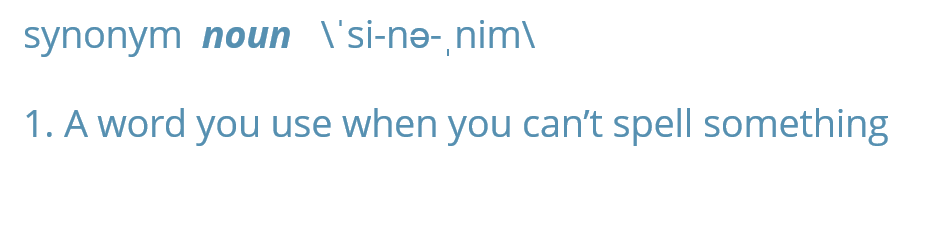

synonym   
============

**synonym** is a synonyms data set wrapped with a few tools for quickly
looking up relevant synonyms.

Table of Contents
============

-   [Functions](#functions)
-   [Demonstration](#demonstration)
-   [Installation](#installation)
-   [Contact](#contact)

Functions
============

<table>
<thead>
<tr class="header">
<th>Function</th>
<th>Description</th>
</tr>
</thead>
<tbody>
<tr class="odd">
<td><code>get_sentiment</code></td>
<td>Lookup relevant synonyms</td>
</tr>
<tr class="even">
<td><code>drop_zero</code></td>
<td>Drop <code>NA</code>s* from <code>get_synonym</code> objects</td>
</tr>
</tbody>
</table>

\**These were terms that are in the synonym key but did not meet the
relevant distance.*

Demonstration
=============

    if (!require("pacman")) install.packages("pacman")

    ## Loading required package: pacman

    pacman::p_load_gh("trinker/synonym")

    get_synonym(c('cat', 'dog', 'chicken', 'dfsf'))

    ## $cat
    ## [1] NA
    ## 
    ## $dog
    ## [1] "puppy"  "pup"    "shadow" "hound"  "plague" "haunt" 
    ## 
    ## $chicken
    ## [1] "poultry" "hen"

    get_synonym('cat', 1)

    ## $cat
    ## [1] NA

    get_synonym('cat', 2)

    ## $cat
    ##  [1] "puma"    "panther" "tabby"   "kitty"   "lynx"    "tiger"   "cougar" 
    ##  [8] "lion"    "puss"    "kitten"  "leopard" "bobcat"  "jaguar"  "tomcat" 
    ## [15] "pussy"   "ocelot"  "tom"     "cheetah" "mouser"

    get_synonym('cat', 3)

    ## $cat
    ## [1] "grimalkin" "malkin"

    get_synonym('cat', 2:3)

    ## $cat
    ##  [1] "puma"      "panther"   "tabby"     "kitty"     "lynx"     
    ##  [6] "tiger"     "cougar"    "lion"      "puss"      "kitten"   
    ## [11] "leopard"   "bobcat"    "jaguar"    "tomcat"    "pussy"    
    ## [16] "ocelot"    "tom"       "cheetah"   "mouser"    "grimalkin"
    ## [21] "malkin"

    drop_zero(
        get_synonym(c('cat', 'dog', 'chicken', 'dfsf'))
    )

    ## $dog
    ## [1] "puppy"  "pup"    "shadow" "hound"  "plague" "haunt" 
    ## 
    ## $chicken
    ## [1] "poultry" "hen"

Installation
============

To download the development version of **synonym**:

Download the [zip
ball](https://github.com/trinker/synonym/zipball/master) or [tar
ball](https://github.com/trinker/synonym/tarball/master), decompress and
run `R CMD INSTALL` on it, or use the **pacman** package to install the
development version:

    if (!require("pacman")) install.packages("pacman")
    pacman::p_load_gh("trinker/synonym")

Contact
=======

You are welcome to:    
- submit suggestions and bug-reports at: <https://github.com/trinker/synonym/issues>    
- send a pull request on: <https://github.com/trinker/synonym/>    
- compose a friendly e-mail to: <tyler.rinker@gmail.com>    